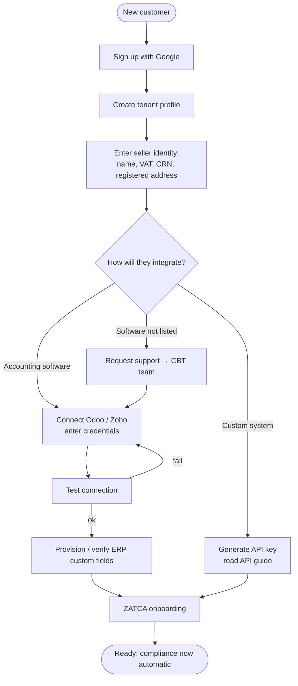
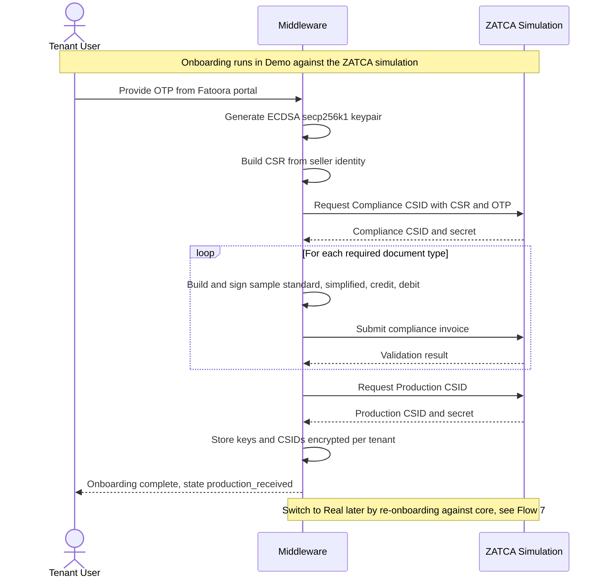
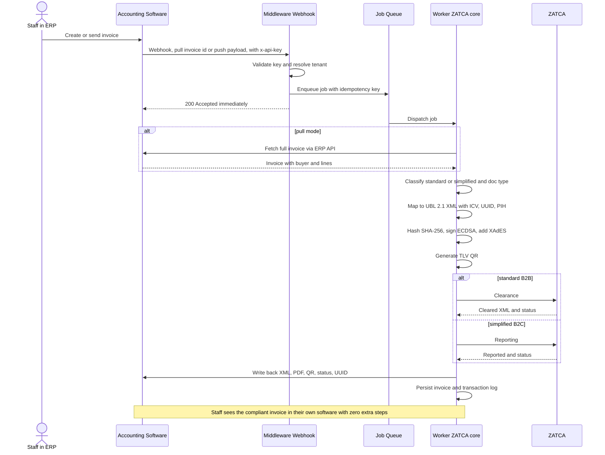
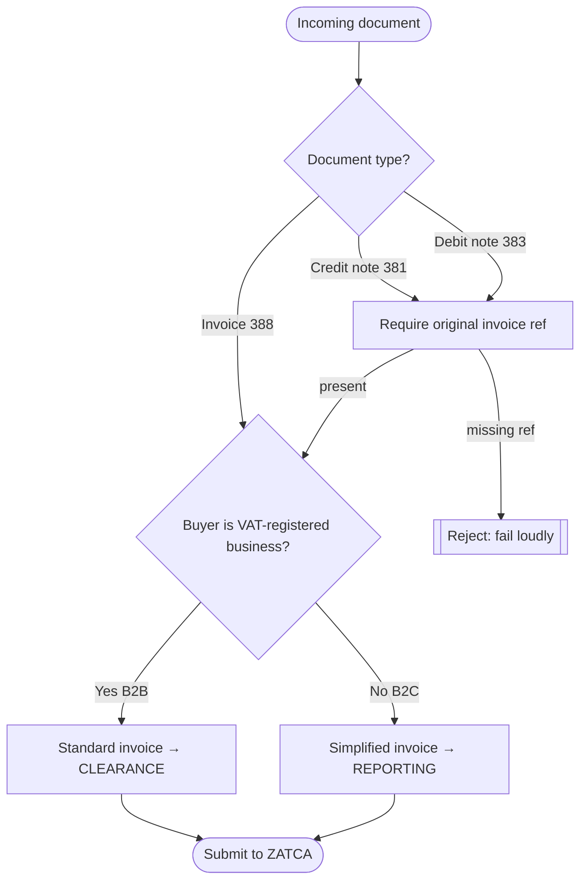
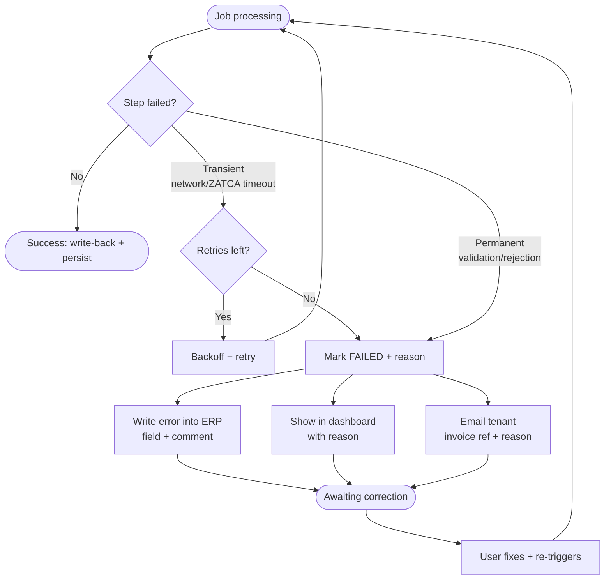
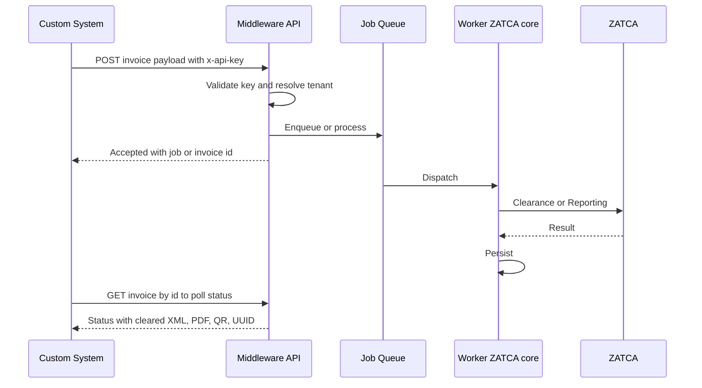
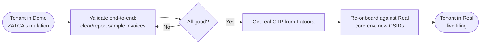

# Flows & Diagrams

| | |
|---|---|
| **Document** | 04 — Flows & Diagrams |
| **Status** | 🟡 DRAFT (v0.1) — for team review |
| **Owner** | Convergent BT |
| **Last updated** | 2026-06-17 |
| **Related docs** | `01-PRD.md`, `02-Actors-and-Capabilities.md`, `03-Functional-Spec.md`, `05-Architecture.md`, `06-ZATCA-Compliance-Reference.md` |

> Visual companion to the Functional Spec. Diagrams use **Mermaid** (renders on GitHub and most Markdown viewers). Each flow cites the `FR-*` it realizes.

---

## 1. Customer Journey (onboarding, end-to-end)

From zero to compliant. One-time. The customer first onboards in **Demo mode** (ZATCA simulation, OTP `123456`) — clearly flagged — then does the deliberate switch to **Real** to go live (see Flow 7). Realizes `FR-AUTH-*`, `FR-CONN-*`, `FR-ONB-*`, `FR-ENV-5..7`.

## 2. ZATCA Onboarding (detail)

CSR → Compliance CSID → compliance checks → Production CSID. Done in **Demo** (ZATCA simulation) first; switch to **Real** later (see Flow 7). Realizes `FR-ONB-1..6`, `FR-ENV-*`.

## 3. Core Automatic Compliance Flow ⭐ (async + queued)

The heart of the product. **No manual middleware step.** Realizes `FR-FLOW-1..10`, `FR-WB-*`, `FR-ERR-*`.

## 4. Invoice Classification (decision logic)

How a document is routed. Realizes `FR-FLOW-2`, `FR-DOC-*`.

## 5. Failure & Retry Flow

What happens when something goes wrong. Realizes `FR-FLOW-10`, `FR-ERR-1..5`.

## 6. Headless API Flow (Mode B)

Custom systems drive the same engine. Realizes `FR-API-*`.

## 7. Environment Promotion (Demo → Real)

Controlled move from **Demo** (ZATCA simulation, OTP 123456) to **Real** (live `core`). Realizes `FR-ENV-1..7`.

> Exact ZATCA environment names/URLs for Demo (simulation) and Real (`core`) are in `06-ZATCA-Compliance-Reference.md`; the full model is in `08-Environments-and-Release-Management.md`.

---

## Legend & Conventions

- **Demo** = ZATCA **simulation** endpoint (OTP `123456`, not legally filed). **Real** = ZATCA **`core`** (real OTP, legally filed). See `08-Environments-and-Release-Management.md`.
- **Pull mode** is the recommended ERP trigger (middleware fetches the full document); **push mode** sends the full payload.
- ⭐ Flow 3 is the canonical path the whole product exists to deliver.
- All flows are **per tenant** and isolated.

---

*End of draft. Review/correct; then we lock and move to Document 05 — Architecture.*
