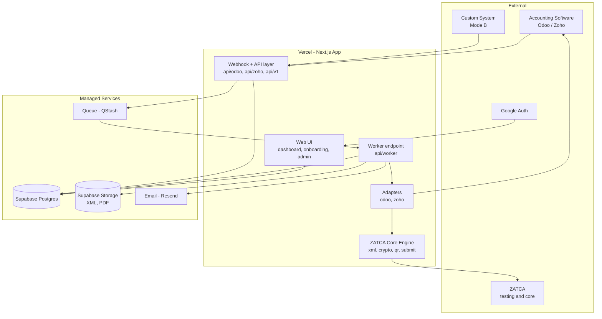

# Architecture

| | |
|---|---|
| **Document** | 05 — Architecture |
| **Status** | 🟢 LOCKED (v1.0) |
| **Owner** | Convergent BT |
| **Last updated** | 2026-06-18 |
| **Related docs** | `01-PRD.md`, `02-Actors-and-Capabilities.md`, `03-Functional-Spec.md`, `04-Flows.md`, `06-ZATCA-Compliance-Reference.md` |

> *How* we build what Docs 03/04 describe. Grounded in the existing code (Next.js 16 + TypeScript + Supabase) and the merge of the two repos (`-zoho`, `-odoo`) into one app (`-dev`). Decisions are explicit; rationale included.

---

## 1. Architecture Principles

1. **One ZATCA core, many adapters.** The compliance engine is written once; each accounting software is a thin, swappable adapter (PRD §7).
2. **Tenant-isolated.** Every record and credential is scoped to an organization (tenant). One cross-tenant actor only: the CBT admin.
3. **Async by default.** Triggers return instantly; work happens in a queued worker with retries (FR-FLOW-9/10).
4. **Serverless-native.** Designed for Vercel — no long-running processes; durable state in Postgres + a managed queue.
5. **Secrets are sacred.** Private keys, CSIDs, and ERP credentials are encrypted at rest; never logged.
6. **Environment-aware.** Testing (simulation) and live (`core`) are first-class, switchable, and never mixed (FR-ENV).

## 2. High-Level Components



## 3. Unified Repository Structure

A single Next.js app. Target layout (`zatca-middleware-dev`):

```
src/
  app/
    (web)/                      # dashboard, onboarding, settings, admin console
    api/
      auth/                     # Google auth callbacks / session
      odoo/   webhook, config   # Odoo adapter endpoints
      zoho/   webhook, config   # Zoho adapter endpoints
      v1/                       # headless API (Mode B)
      worker/                   # queue consumer (processes one job)
      admin/                    # CBT cross-tenant console APIs
  lib/
    core/zatca/                 # SHARED ENGINE — the crown jewels
      xml/  crypto/  qr/  validation/
      onboarding.ts  transactions.ts  environments.ts
    adapters/
      adapter.ts                # AccountingAdapter interface (the contract)
      odoo/                     # implements adapter via JSON-RPC
      zoho/                     # implements adapter via Books v3 + OAuth2
      registry.ts               # maps tenant config -> adapter
    queue/                      # QStash publish + job model + idempotency
    crypto/secrets.ts           # encrypt/decrypt at rest
    db/                         # Supabase client, repositories
    auth/                       # session, API-key validation
  types/
```

**Merge plan:** take the stronger of the two existing implementations per module (they share ~90% of the core), lift the Odoo and Zoho clients into `lib/adapters/*` behind the common interface, delete the duplicate cores.

## 4. The Adapter Contract

Every accounting software implements one interface; the core never knows which ERP it's talking to.

```ts
interface AccountingAdapter {
  testConnection(cfg): Promise<Result>           // FR-CONN-2
  provisionOrVerifyFields(cfg): Promise<FieldStatus>  // FR-CONN-4
  fetchInvoice(ref): Promise<ErpDocument>        // pull mode (FR-FLOW-1)
  toCanonical(doc): CanonicalInvoice             // FR-FLOW-3 (map to ZATCA model)
  writeBack(ref, result): Promise<void>          // FR-WB-* (XML, PDF, QR, status, UUID)
}
```

- **Odoo adapter:** JSON-RPC; write-back to `x_zatca_*` fields + attachments + chatter.
- **Zoho adapter:** Books v3 REST + OAuth2 refresh-token; write-back to `cf_zatca_*` + comments + attachments.
- **Adding D365/Oracle later** = a new class implementing this interface. Zero core changes.
- **Mode B** bypasses adapters: the customer sends a `CanonicalInvoice` directly to the API.

## 5. Async Processing (queue + worker)

The single most important runtime decision (FR-FLOW-9/10).

**Decision: a durable `jobs` table in Postgres + a Supabase Database Webhook to trigger the worker + a Vercel Cron retry sweep. Stay within Supabase + Vercel for now — no third-party broker.**

```
Webhook/API   →  write jobs row (status=queued, idempotency_key)
              →  return 200 immediately
Supabase DB   →  Database Webhook on insert  →  POST /api/worker (near-real-time)
Worker        →  load job; if already done, no-op (idempotent)
              →  run core pipeline (build → sign → QR → submit → write-back)
              →  on success: mark done; on transient error: increment attempts + schedule retry
Vercel Cron   →  every minute, sweep due 'queued'/'retry' jobs (retry with backoff + recover stuck jobs)
```

**Why this:** keeps everything in **Supabase + Vercel** (no extra vendor), per the "Supabase for now" decision. Database Webhooks give near-real-time triggering; the Cron sweep guarantees retries/backoff and recovers anything stuck. **Upgrade path:** if volume/latency ever demands it, swap the trigger for a managed queue (e.g. Upstash QStash) **without changing the worker** — the `jobs` table stays the contract.

**Idempotency:** `(organization_id, invoice_ref, document_type)` is the key; re-delivery never double-submits or double-attaches (FR-WB-4).

## 6. Data Model

Building on the existing Supabase schema (`organizations`, `zatca_profiles`, `invoices`, `transaction_logs`, `api_keys`, `odoo_config`, `zoho_config`). Additions/changes for v1:

| Table | Purpose | Notes |
|---|---|---|
| `users` | Google-auth users | id, email, google_sub, created_at |
| `tenant_members` | many users ↔ one org (FR-AUTH-6) | (organization_id, user_id), all equal |
| `jobs` | async work queue record | status, idempotency_key, attempts, last_error, payload |
| `zatca_profiles` *(extend)* | add `environment` (testing/live), `csid_expires_at` | drives FR-ENV + expiry warnings (FR-ONB-7) |
| `organizations` *(extend)* | add full **seller address** fields | fixes the placeholder gap (FR-AUTH-4) |
| `odoo_config` / `zoho_config` *(change)* | credentials stored **encrypted** | fixes cleartext gap (FR-CONN-3) |
| Supabase **Storage** | signed XML + cleared PDF artifacts | referenced from `invoices` |

Invoice/transaction tables keep their audit role (FR-FLOW-8, FR-DASH-3).

## 7. Secrets & Encryption

- **At rest:** ERP credentials, ZATCA private keys, CSIDs, secrets are stored **encrypted** (AES-256-GCM) — ciphertext in Postgres, master key in a Vercel environment variable (path to a managed KMS later).
- **API keys:** stored only as SHA-256 hashes (already the case).
- **In transit:** HTTPS everywhere; webhook auth via `x-api-key`.
- **Never logged:** secrets are redacted from all logs and transaction records.
- **Per-tenant isolation** enforced at the repository/query layer (and Postgres RLS where applicable).

## 8. Environments (Demo → Real)

Two independent dimensions — see `08-Environments-and-Release-Management.md` for the full model:
- **Our deploy env** (Local → Preview → Production on Vercel) is separate from **which ZATCA API a tenant targets**.
- `lib/core/zatca/environments.ts` resolves the ZATCA base URLs from the tenant's `environment` setting: **simulation** (OTP `123456`, not legal — surfaced to users as **Demo**) vs **`core`** (real OTP, legally filed — surfaced as **Real**). *(Exact URLs in Doc 06; existing code is missing `core` and must add it.)*
- A tenant starts in **Demo**; the UI shows a persistent Demo-mode banner (FR-ENV-5/6).
- **Switch to Real** re-onboards the tenant against `core` with fresh CSIDs — a deliberate, guided action (FR-ENV-7). Demo and Real credentials are stored separately and never mixed.

## 9. Authentication

- **Humans:** **Google authentication** (Supabase Auth Google provider or Auth.js). First login creates the user + tenant; invites add members (FR-AUTH-6).
- **Machines (ERP webhooks, Mode B):** tenant **API keys** (`x-api-key`), hashed at rest, resolve to exactly one tenant.
- **CBT admin:** privileged internal access, cross-tenant, audited (FR-OPS-*).

## 10. Stack Summary

| Concern | Choice | Rationale |
|---|---|---|
| App framework | Next.js 16 + TypeScript | existing code; API routes + UI in one deploy |
| Hosting | **Vercel** | per PRD §10; serverless |
| Database | Supabase Postgres | existing; multi-tenant, RLS |
| Auth | Supabase Auth (Google) | matches DB choice |
| File storage | Supabase Storage | signed XML + PDF artifacts |
| Queue | **Supabase** (`jobs` table + Database Webhooks) + Vercel Cron | stays in-stack, no extra vendor; QStash is the upgrade path |
| Email | **Resend** | failure alerts (FR-ERR-5), free tier |
| Crypto | Node `crypto` (ECDSA secp256k1, SHA-256) | existing, ZATCA-compliant |

## 11. Resolved Decisions (this doc)

- [x] **Queue mechanism** → Postgres `jobs` table + **Supabase Database Webhook** trigger + Vercel Cron retry sweep (FR-FLOW-9/10). QStash is the documented upgrade path, not v1.
- [x] **Adapter contract** → single `AccountingAdapter` interface; ERPs are pluggable; Mode B bypasses to the canonical model.
- [x] **Repo** → one Next.js app; shared `core/zatca`, `adapters/*`; duplicate cores deleted.
- [x] **Secrets** → AES-256-GCM at rest, master key in env (KMS later); API keys hashed.
- [x] **Auth** → Google via Supabase Auth; API keys for machines.
- [x] **Storage** → Supabase Storage for XML/PDF.

## 12. Resolved Decisions (locked v1.0)

- [x] **ARC-a — Queue:** **Supabase for now** — `jobs` table + Database Webhook trigger + Vercel Cron sweep. QStash is the upgrade path if volume/latency demands, with no worker changes.
- [x] **ARC-b — Email:** **Resend** for failure/alert emails (FR-ERR-5).
- [x] **ARC-c — KMS:** **Deferred.** v1 uses an app-level AES-256-GCM master key stored in a Vercel environment variable; adopting a managed KMS is a documented hardening fast-follow (not worth the v1 complexity for a free product).

---

*Locked v1.0. Next: Document 06 — ZATCA Compliance Reference (final doc).*
